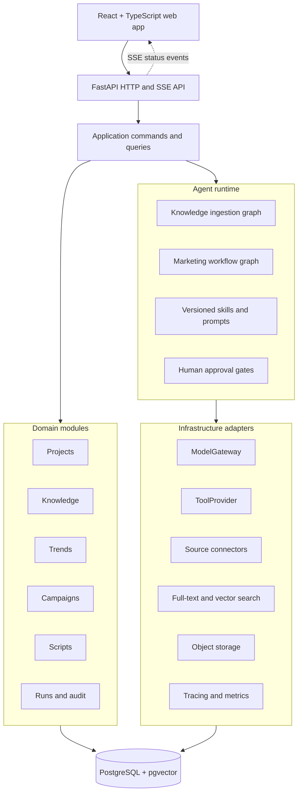

# GameCrafter

> An evidence-aware game knowledge and marketing workspace for independent game developers.

[](https://www.python.org/)
[](https://react.dev/)
[](https://fastapi.tiangolo.com/)
[](LICENSE)

GameCrafter is being rebuilt from an early architecture shell into a long-term product for independent game developers. It will organize game information into a traceable knowledge hub, connect that knowledge to real market signals, and help users create, evaluate, revise, and approve marketing scripts.

The first complete product slice focuses on marketing a real game to English-speaking TikTok audiences. The default validation case is **NTE: Neverness to Everness (《异环》)**.

## Current status

The repository is currently in **M0: repository and engineering restructuring**.

Implemented in M0:

- a modular-monolith project layout;
- a FastAPI health endpoint;
- a React health/status page;
- project-local Python environment and repeatable scripts;
- baseline tests and continuous integration;
- product, architecture, migration, and roadmap documentation.

Not implemented yet:

- website or document ingestion;
- a production Game Knowledge Hub;
- live trend sources;
- LLM calls, RAG, or marketing agents;
- authentication, multi-tenancy, billing, or team collaboration.

The earlier README described several of these as if they already existed. They did not. The original placeholder modules remain traceable in Git history and are documented under [`legacy/`](legacy/README.md).

## Product workflow DAG

```mermaid
flowchart LR
    subgraph Sources["Evidence sources"]
        A1["Official websites"]
        A2["Official news and patch notes"]
        A3["Official video transcripts"]
        A4["User-owned documents"]
    end

    subgraph Knowledge["Game Knowledge Hub"]
        B1["Capture source snapshots"]
        B2["Extract entities and claims"]
        B3["Detect versions and conflicts"]
        B4{"Human fact review"}
        B5["Publish knowledge snapshot"]
    end

    subgraph Marketing["Marketing Studio"]
        C1["Fetch real trend signals"]
        C2["Normalize, deduplicate, cluster"]
        C3["Explain game-market fit"]
        C4{"Human topic approval"}
        C5["Create marketing brief"]
        C6["Generate structured script"]
        C7["Evaluate and revise low-score sections"]
        C8{"Human final approval"}
        C9["Export reusable deliverables"]
    end

    Sources --> B1
    B1 --> B2 --> B3 --> B4
    B4 -->|"approve"| B5
    B4 -->|"edit or reject"| B2
    B5 --> C3
    C1 --> C2 --> C3 --> C4
    C4 -->|"approve"| C5 --> C6 --> C7 --> C8
    C4 -->|"reject"| C1
    C8 -->|"revise"| C6
    C8 -->|"approve"| C9
```



The graph is deliberately constrained. Specialized agent nodes operate inside a deterministic workflow; models do not form an unrestricted autonomous agent swarm. Human approval is required before topic selection and final export.

## Software architecture DAG



See [`docs/architecture/system-architecture.md`](docs/architecture/system-architecture.md) for the knowledge-ingestion and marketing state graphs, data trust boundaries, and design rationale.

## Repository layout

```text
apps/
  api/                  FastAPI application entrypoint
  web/                  React and TypeScript frontend
src/gamecrafter/
  api/                  HTTP application factory and routes
  domain/               Business entities and rules
  application/          Commands, queries, and orchestration services
  agents/               Graphs, nodes, skills, prompts, and schemas
  infrastructure/       Database, source, model, storage, and tracing adapters
  config/               Validated settings
tests/                  Unit, integration, contract, and future E2E tests
docs/                   Product, architecture, security, migration, and roadmap
scripts/                Setup, development, and verification helpers
legacy/                 Notes about the original placeholder shell
```

## Quick start

Prerequisites:

- Python 3.12 or newer;
- Node.js 22 or newer;
- pnpm 10 or newer.

From PowerShell:

```powershell
.\scripts\setup.ps1
.\scripts\start.ps1
```

The local services will be available at:

- web: `http://localhost:5173`
- API: `http://localhost:8000`
- API health: `http://localhost:8000/health`

Run all M0 checks:

```powershell
.\scripts\verify.ps1
```

Configuration names and safe placeholders are documented in [`.env.example`](.env.example). Never commit real API keys.

## Documentation

- [Product baseline](docs/product/baseline-v2.md)
- [System architecture and DAGs](docs/architecture/system-architecture.md)
- [Architecture decisions](docs/architecture/adr/)
- [Long-term roadmap](docs/roadmap.md)
- [M0 migration record](docs/migration/m0-restructure.md)
- [Security baseline](docs/security/local-development.md)

## Development principles

- Build one real vertical slice before adding broad feature surface.
- Keep facts, model judgments, and human decisions visually and structurally distinct.
- Preserve source, time, version, region, and human-review evidence.
- Treat external content as untrusted input.
- Describe only capabilities that have actually been implemented and verified.
- Keep the core as a modular monolith until real scaling or isolation needs justify a service split.

## License

This project is licensed under the [MIT License](LICENSE).
