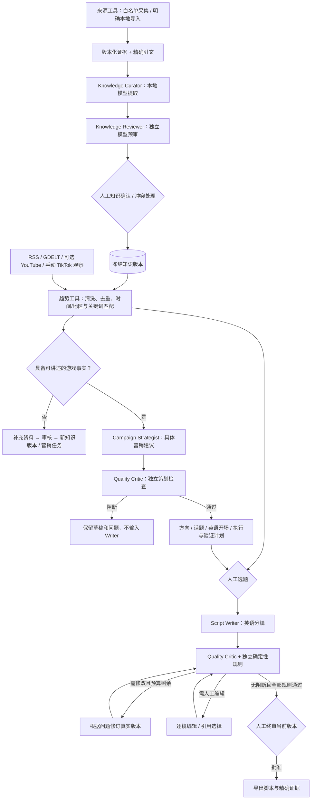
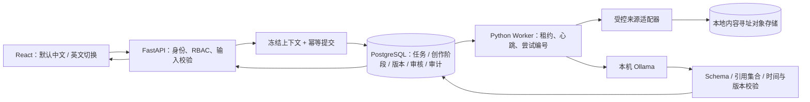
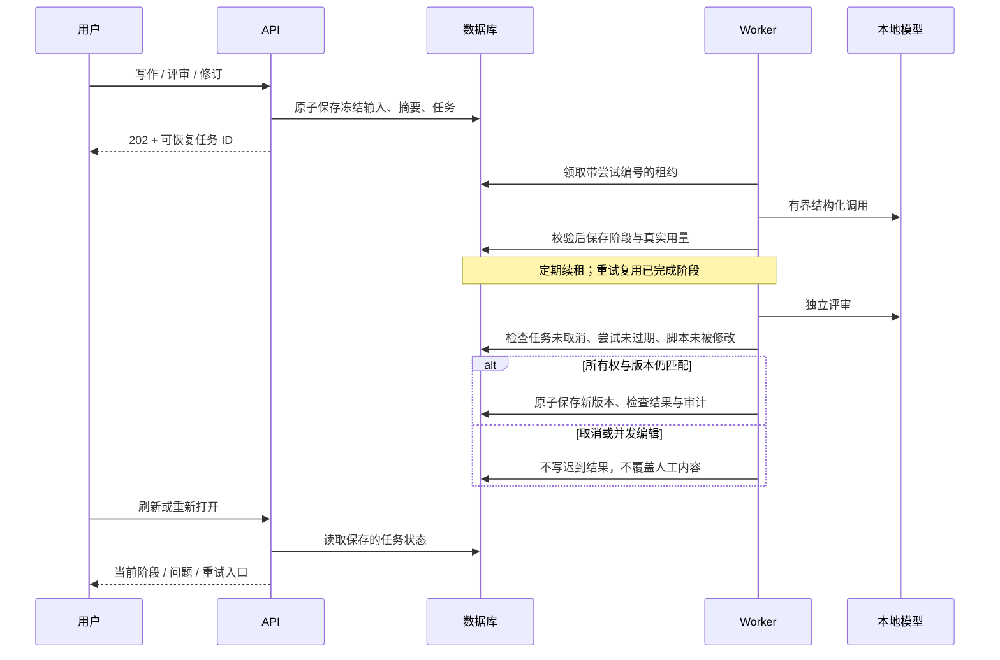

# 系统架构与工作流 DAG

本页描述 M19 当前实现；旧里程碑图移至 [历史 DAG](../migration/architecture-through-m18.md)，
不再将“未来设计”“规则工具”和“真实模型调用”混在同一张当前架构图中。

## 1. 产品主链路

策划是有评审状态的建议，不是自动批准的选题。Writer 只使用同一候选、通过初审的策划结果；
没有合格策划时仍可根据已经人工批准的选题与事实写作，但不能借用被阻断的建议。
模型初审是辅助质量关口，不能保证绝无幻觉，也不能替代最终内容负责人。

## 2. 运行时结构

API 请求只提交创作任务，不占用一个长时间模型 HTTP 响应。
创作进度通过有界轮询恢复；原有来源/知识审计 SSE 仍保留。
错误保持可见，不用空白候选列表或绿色“已入队”代替完成状态。

## 3. 谁是 Agent，谁不是

| 角色 | 当前方式 | 输出或职责 |
|---|---|---|
| Knowledge Curator | 模型 | 候选事实与精确证据位置 |
| Knowledge Reviewer | 独立模型调用 | 保留 / 排除 / 待人工建议，不写人工批准 |
| Campaign Strategist | 模型 | 有证据约束的营销方案 |
| Script Writer | 模型 | 五镜英语脚本，或按评审问题修订 |
| Quality Critic | 独立模型调用 | 策划或脚本中的具体问题与修改建议 |
| 来源与溯源 | 确定性工具 | URL / DNS / robots / 采集预算 / 版本 |
| 趋势分析 | 确定性工具 | 清洗、去重、时效和匹配解释 |
| GDD 整理 | 确定性工具 | 结构解析、章节和人工假设管理 |

这意味着 **5 个模型角色 + 3 个工具角色**，不是 8 个大模型相互聊天。
同一个本地模型可以承担多个角色，角色独立指输入与调用独立，不代表多个独立模型
就能消除共同偏差。审核结果仍可能错误。

Harness 是模型之外的 Python 控制逻辑：身份、权限、执行次数、I/O 范围、幂等、取消、
来源完整性、版本比较与发布许可均不能被模型修改。
现有知识图工作流与创作任务共用持久化基座；没有为了使用框架而另起一套分布式队列。

## 4. 失败与恢复

- 写作已完成而评审请求失败：重试复用写作阶段，避免重复保存版本。
- 无效 JSON、外部引用、无变化修订：不把它们缓存为有效阶段。
- 同一工作流反复点击：复用在途操作。不同操作冲突则明确拒绝。
- 手动重试保持尝试编号单调增加；旧 Worker 即使同名，也不能完成新的租约。
- 编辑后必须重新评审；当前版本的**最近终审**必须批准，且指向同一次最新有效检查。
  历史批准不能覆盖后续拒绝。
- 有限次数修订不是无限自愈；预算耗尽后进入人工编辑。

## 5. 数据与隐私

来源版本、引文、人工事实审核、知识快照、脚本版本与人工终审保持各自身份。
`creative_operations` 保存冻结输入、哈希、模型、阶段缓存和结果引用；
脚本版本附带生成来源，评测记录附带独立语义报告。
通用项目备份/恢复按外键遍历包含这些记录；它们与原始资料一样可能包含私有内容，
只在本地受控库和用户明确导出的备份中保存。

对外只开放既有来源连接器。模型地址仅允许本机回环或精确的 Docker 主机别名，
不使用系统代理、不自动转发到付费云端。模型没有浏览器、文件删除或发布工具。
生产日志不记录原始 prompt、上传全文、密码或模型推理过程。

## 6. 刻意不做的事

不自动投放、不抓取 TikTok 私有页面、不生成最终视频、不假装拥有素材授权；
不在线自改 prompt 或训练模型，不让审核 Agent 提升自己的权限。
本项目属于有证据约束的 Agent 应用与人机协作工作流，不需要为了命名先进而套用
ReAct/ReWOO，也不把计划中的 MCP 或未接入的云适配器写成运行中的能力。

运行记录可供离线评估和后续改进，但不会未经确认自动“学习”并修改系统行为。
部署、负载能力和商业效果必须独立验收，不能从单机测试推断。
