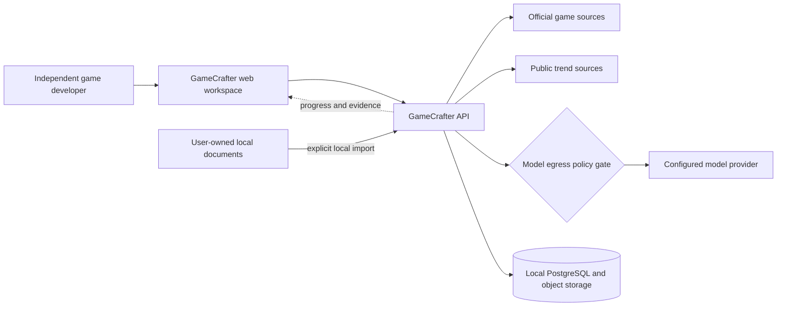
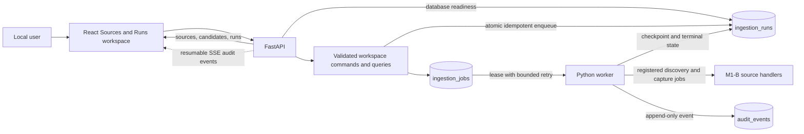
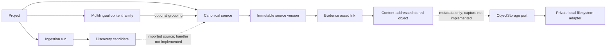
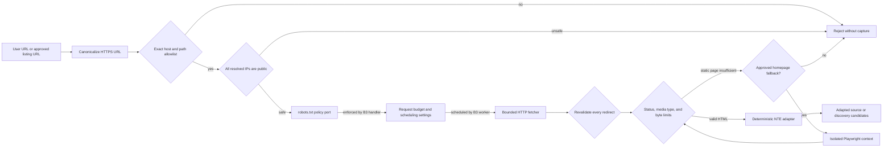
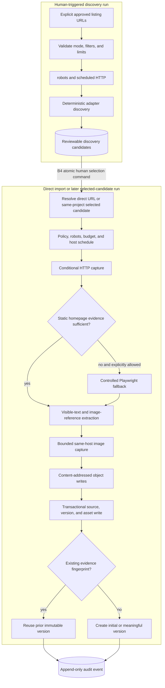
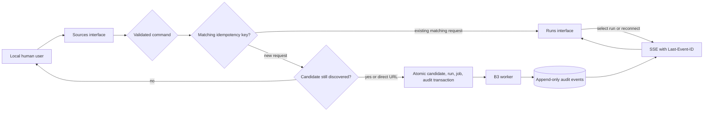
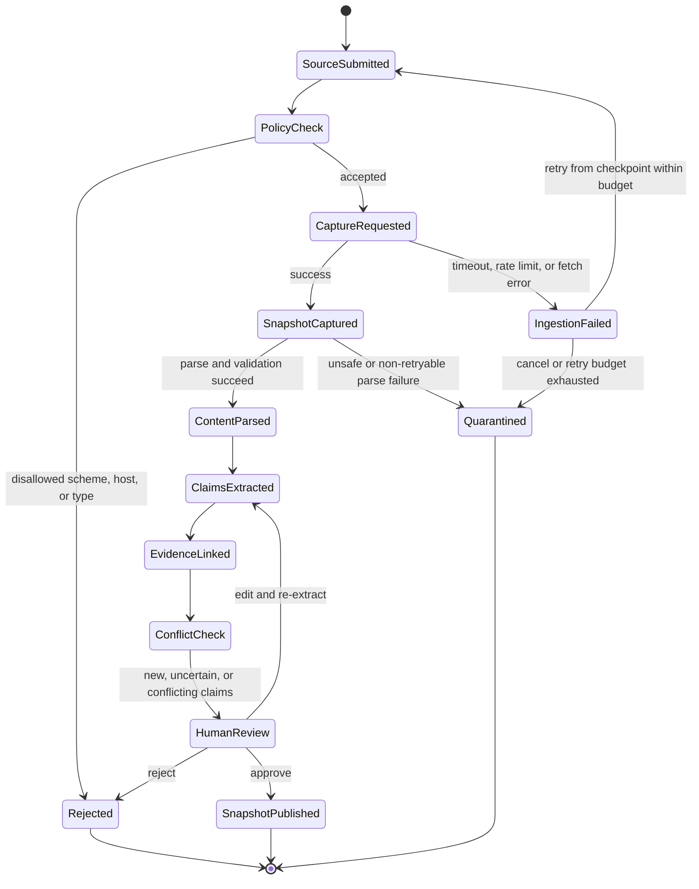
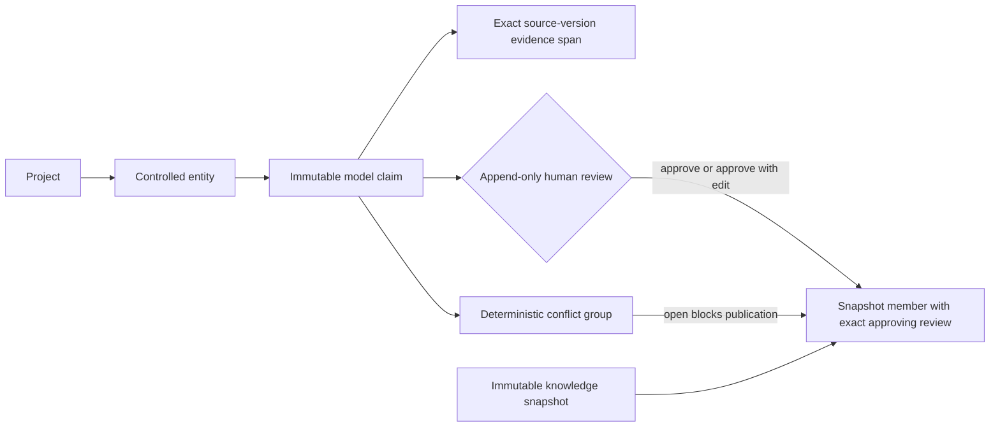
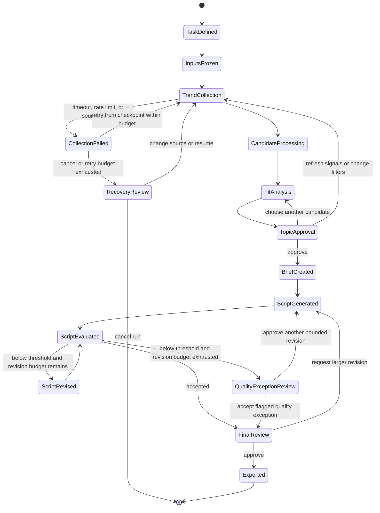

# System architecture and workflow DAGs

GameCrafter v2 uses a modular monolith with explicit domain and adapter boundaries. The design prioritizes traceability, local development, testability, and a path to future multi-tenant operation without prematurely creating distributed services.

## System context

External pages, trend responses, model responses, and imported documents cross a trust boundary. They are treated as untrusted data, validated, versioned, and prevented from directly controlling tools. Before any model call, the egress gate shows which data will leave the machine, applies provider policy, and redacts secrets or unnecessary private content.

## Implemented M1-A to M1-B runtime

The worker-to-handler arrow is implemented in M1-B B3; the commands, queries, and event delivery are
implemented in B4. PostgreSQL owns project, candidate, run, job, and audit consistency. The worker
never claims a website or model capability until its typed handler is implemented and registered.

## Implemented M1-B B1 evidence contracts

B1 creates these domain, database, and storage contracts. It does not discover or capture a live
website. PostgreSQL prevents updates to stored-object metadata, source versions, and evidence links;
a meaningful change must create a new version. Physical object deletion remains a later,
dependency-aware application command.

## Implemented M1-B B2 controlled source boundary

All access-flow arrows are wired by B3. HTTP is the default. Browser rendering is allowed only for
explicitly listed NTE homepage paths, runs in a fresh context, blocks downloads, popups, service
workers, and cross-host requests, and still applies the same final-URL and response-size boundary.

The first adapters accept only `nte.perfectworld.com` global pages under `en`, `cn`, or `jp`, plus
`yh.wanmei.com` mainland pages. Listing pages can produce reviewable candidates but cannot be
directly imported as evidence. Homepage and article URLs are assigned deterministic locale, region,
source type, raw category, and classification-basis metadata. A date segment in an article URL is
kept only as a family-grouping signal; it is not asserted as the publication date.

## Implemented M1-B B3 ingestion and persistence flow

Discovery and capture are deliberately separate durable runs. A candidate may be captured only
after it is selected and belongs to the capture run's project; this preserves the human gate
without trying to reopen an already completed discovery run. Direct URL import is itself an
explicit human action. No scheduled or recursive crawl exists.

## Implemented M1-B B4 delivery and observability

Candidate selection and run enqueue commit together. Conflicting idempotency-key reuse and stale
candidate selection are rejected rather than silently creating ambiguous work. SSE reads only
project/run audit records, uses a durable cursor, and never sends raw evidence bytes or credentials.
The interface defaults to Simplified Chinese because the product users are often Chinese studios;
English is an explicit remembered preference even though the first marketing target is English
TikTok.

The version fingerprint covers the parser version, normalized text, and captured image digests.
Byte-identical or semantically unchanged recaptures reuse the existing version. Changed text or an
evidence image creates a new immutable version linked to its predecessor. Raw HTML remains stored
for replay even though incidental markup-only changes do not automatically create versions.

## Knowledge-ingestion state graph

Key rules:

- raw snapshots are immutable;
- processed documents record parser and schema versions;
- claims preserve source, time, region, version, and evidence spans;
- uncertain or conflicting claims do not become approved facts automatically;
- marketing runs reference a frozen knowledge snapshot, not mutable live records.
- retry counts, terminal failures, and quarantine reasons remain visible in the run record.

## Implemented M1-C C1 reviewable knowledge lineage

The claim is never updated into a fact. Its model value, evidence, model name, prompt version,
schema version, locale, region, effective time, and game version remain immutable. A human decision
is a separate append-only record; an approved edit stores the exact accepted value without erasing
the model output. Snapshot membership references that specific approving review.

PostgreSQL triggers reject approval without evidence, reject cross-project review or snapshot
lineage, reject snapshot membership while a claim belongs to an open conflict group, and prevent
changes to published knowledge lineage. Application commands in C3 and C4 will explain these gates
before transaction execution and will prevent empty snapshots.

## Marketing workflow state graph

The run freezes the task definition, knowledge snapshot, source policy, model, prompt, skill, and rule versions before generation. The revision loop has a fixed budget. A model score never replaces topic or final-output approval, and an exhausted budget cannot silently convert a low-quality script into an accepted one. The Agent Harness routes retryable model or tool failures back to the last safe checkpoint and exposes terminal failures for human recovery.

## Component relationships

```mermaid
flowchart TB
    subgraph Delivery["Delivery"]
        WEB["apps/web"]
        FASTAPI["apps/api and gamecrafter.api"]
    end

    subgraph Application["Application layer"]
        COMMANDS["Commands"]
        QUERIES["Queries"]
        SERVICES["Orchestration services"]
        PORTS["Workflow and outbound ports"]
    end

    subgraph Domain["Domain layer"]
        PROJECTS["Projects"]
        KNOWLEDGE["Knowledge"]
        TRENDS["Trends"]
        CAMPAIGNS["Campaigns"]
        SCRIPTS["Scripts"]
        RUNS["Runs"]
    end

    subgraph Runtime["Constrained agent runtime"]
        HARNESS["Agent Harness"]
        GRAPHS["LangGraph graphs"]
        NODES["Specialist nodes"]
        SKILLS["Skills and prompts"]
        GATES["Human gates"]
    end

    subgraph Infrastructure["Infrastructure"]
        DATABASE["Database repositories"]
        INGESTION["Source connectors and parsers"]
        SEARCH["Hybrid search"]
        MODELS["ModelGateway"]
        TOOLS["ToolProvider"]
        STORAGE["ObjectStorage"]
        OBS["RunTracer"]
    end

    WEB --> FASTAPI
    FASTAPI --> COMMANDS
    FASTAPI --> QUERIES
    COMMANDS --> SERVICES
    QUERIES --> SERVICES
    SERVICES --> Domain
    SERVICES --> PORTS
    HARNESS --> GRAPHS --> NODES
    HARNESS --> GATES
    GRAPHS --> PORTS
    Runtime --> Domain
    Infrastructure --> PORTS
    Infrastructure --> Domain
```

The arrows in this diagram show source-code dependency direction, not runtime data flow. Delivery depends on application contracts; runtime and infrastructure adapters implement application ports and depend inward on application/domain contracts. Domain modules never depend on infrastructure. This direction is enforced by convention and architecture tests: domain modules must not import FastAPI, LangGraph, model SDKs, database drivers, or source-specific clients.

## Agent Harness

The Agent Harness is the controlled execution shell around graphs and specialist nodes. It is not another model or simulated employee. It provides:

- typed state validation before and after every node;
- checkpoints, idempotency keys, resumable human pauses, and replay metadata;
- model, token, latency, cost, tool-call, retry, and wall-clock budgets;
- tool allowlists, argument validation, timeouts, cancellation, and permission checks;
- model-egress review, secret redaction, and untrusted-content isolation;
- structured failure states and last-safe-checkpoint recovery;
- trace propagation across models, tools, human decisions, and exports.

The initial ToolProvider implementations stay in-process. MCP is an optional adapter behind that boundary only when cross-application reuse or independently managed permissions justify it; MCP is not the core orchestration mechanism.

## Planned specialist nodes

- Knowledge Curator: structures evidence-backed game claims.
- Trend Analyst: clusters trends and explains task fit.
- Script Writer: produces structured script versions from approved inputs.
- Quality Critic: evaluates explicit dimensions and proposes bounded revisions.

These are workflow roles, not simulated employees. Parallelism is used for independent source fetches, candidate analyses, and evaluation dimensions; human decisions remain sequential gates.

## Reasoning and learning policy

Specialist research nodes may use a bounded `Perceive → Reason → Act → Evaluate` cycle. ReAct is limited to nodes that genuinely need tools and always runs inside Harness budgets and allowlists. ReWOO is not the global workflow pattern because the state graph already provides an explicit, inspectable plan.

`Learn` is intentionally outside the live run. Production agents cannot rewrite their own prompts, skills, policies, or tools. Human-approved feedback becomes a versioned offline evaluation case; a tested prompt, skill, rule, or model update is then released as a new version. This prevents silent behavior drift and preserves rollback and attribution.

## Storage direction

M1-A implements PostgreSQL, enables pgvector, and stores projects, ingestion runs, leased jobs, and
audit events. M1-B B1 adds source identities, immutable evidence versions, multilingual content
families, discovery candidates, stored-object metadata, and evidence links. Large bytes use the
`ObjectStorage` application port; its first adapter is a private content-addressed local filesystem.
B2 adds source-policy, `PageFetcher`, and `SiteAdapter` boundaries. B3 writes raw HTML, normalized
text, bounded official images, source identities, version lineage, evidence links, and audit events
through registered worker handlers. B4 reads project-scoped summaries and creates candidate/run/job
state in one PostgreSQL transaction; SSE projects append-only audit events to the browser.
PostgreSQL and object storage cannot commit atomically;
content-addressed files written immediately before a failed DB transaction may be left unreferenced
and require a later safe garbage-collection command. Embeddings and claim records remain
unimplemented.

M1-C C1 adds project-local entities, immutable candidate claims, exact evidence ranges, append-only
human reviews, conflict groups, and immutable knowledge snapshots. It does not yet add extraction,
model calls, conflict classification, review APIs, or embeddings.

## Observability

Each future run will record:

- run and trace identifiers;
- node state and checkpoint;
- source, model, prompt, skill, and rule versions;
- tool calls, latency, retries, token usage, and estimated cost;
- redacted input/output hashes, egress decisions, and failure classifications;
- human approvals, edits, rejections, and reasons;
- script version lineage and export state;
- evaluation dataset, rubric, threshold, and release versions.
