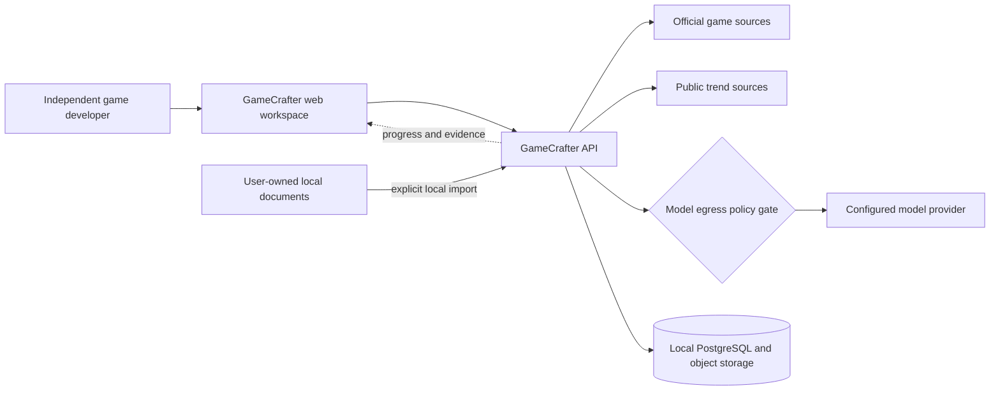
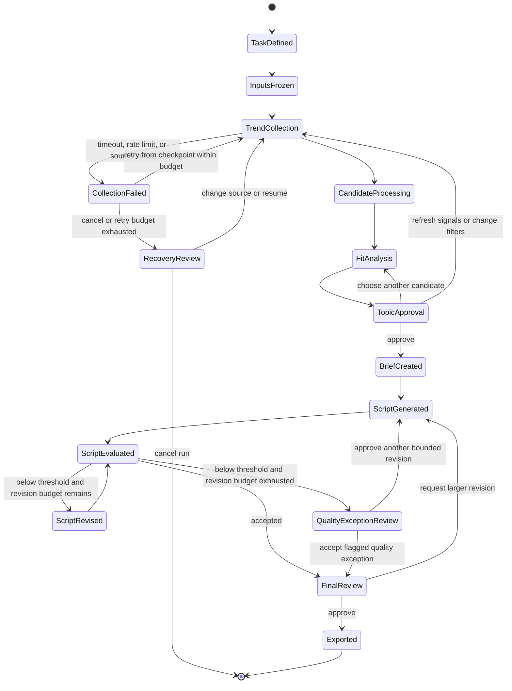
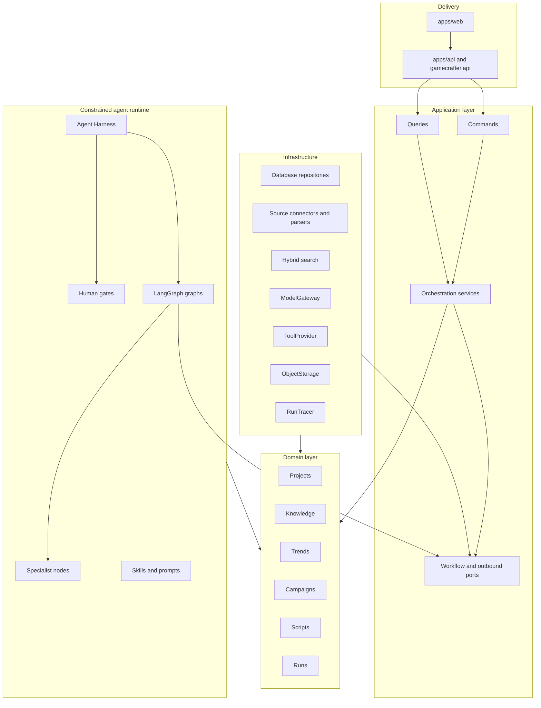

# System architecture and workflow DAGs

GameCrafter v2 uses a modular monolith with explicit domain and adapter boundaries. The design prioritizes traceability, local development, testability, and a path to future multi-tenant operation without prematurely creating distributed services.

## System context

External pages, trend responses, model responses, and imported documents cross a trust boundary. They are treated as untrusted data, validated, versioned, and prevented from directly controlling tools. Before any model call, the egress gate shows which data will leave the machine, applies provider policy, and redacts secrets or unnecessary private content.

## Knowledge-ingestion state graph

```mermaid
stateDiagram-v2
    [*] --> SourceSubmitted
    SourceSubmitted --> PolicyCheck
    PolicyCheck --> Rejected: disallowed scheme, host, or type
    PolicyCheck --> CaptureRequested: accepted
    CaptureRequested --> SnapshotCaptured: success
    CaptureRequested --> IngestionFailed: timeout, rate limit, or fetch error
    SnapshotCaptured --> ContentParsed: parse and validation succeed
    SnapshotCaptured --> Quarantined: unsafe or non-retryable parse failure
    IngestionFailed --> SourceSubmitted: retry from checkpoint within budget
    IngestionFailed --> Quarantined: cancel or retry budget exhausted
    ContentParsed --> ClaimsExtracted
    ClaimsExtracted --> EvidenceLinked
    EvidenceLinked --> ConflictCheck
    ConflictCheck --> HumanReview: new, uncertain, or conflicting claims
    HumanReview --> ClaimsExtracted: edit and re-extract
    HumanReview --> Rejected: reject
    HumanReview --> SnapshotPublished: approve
    SnapshotPublished --> [*]
    Rejected --> [*]
    Quarantined --> [*]
```

Key rules:

- raw snapshots are immutable;
- processed documents record parser and schema versions;
- claims preserve source, time, region, version, and evidence spans;
- uncertain or conflicting claims do not become approved facts automatically;
- marketing runs reference a frozen knowledge snapshot, not mutable live records.
- retry counts, terminal failures, and quarantine reasons remain visible in the run record.

## Marketing workflow state graph

The run freezes the task definition, knowledge snapshot, source policy, model, prompt, skill, and rule versions before generation. The revision loop has a fixed budget. A model score never replaces topic or final-output approval, and an exhausted budget cannot silently convert a low-quality script into an accepted one. The Agent Harness routes retryable model or tool failures back to the last safe checkpoint and exposes terminal failures for human recovery.

## Component relationships

The arrows in this diagram show source-code dependency direction, not runtime data flow. Delivery depends on application contracts; runtime and infrastructure adapters implement application ports and depend inward on application/domain contracts. Domain modules never depend on infrastructure. This direction is enforced by convention and architecture tests: domain modules must not import FastAPI, LangGraph, model SDKs, database drivers, or source-specific clients.

## Agent Harness

The Agent Harness is the controlled execution shell around graphs and specialist nodes. It is not another model or simulated employee. It provides:

- typed state validation before and after every node;
- checkpoints, idempotency keys, resumable human pauses, and replay metadata;
- model, token, latency, cost, tool-call, retry, and wall-clock budgets;
- tool allowlists, argument validation, timeouts, cancellation, and permission checks;
- model-egress review, secret redaction, and untrusted-content isolation;
- structured failure states and last-safe-checkpoint recovery;
- trace propagation across models, tools, human decisions, and exports.

The initial ToolProvider implementations stay in-process. MCP is an optional adapter behind that boundary only when cross-application reuse or independently managed permissions justify it; MCP is not the core orchestration mechanism.

## Planned specialist nodes

- Knowledge Curator: structures evidence-backed game claims.
- Trend Analyst: clusters trends and explains task fit.
- Script Writer: produces structured script versions from approved inputs.
- Quality Critic: evaluates explicit dimensions and proposes bounded revisions.

These are workflow roles, not simulated employees. Parallelism is used for independent source fetches, candidate analyses, and evaluation dimensions; human decisions remain sequential gates.

## Reasoning and learning policy

Specialist research nodes may use a bounded `Perceive → Reason → Act → Evaluate` cycle. ReAct is limited to nodes that genuinely need tools and always runs inside Harness budgets and allowlists. ReWOO is not the global workflow pattern because the state graph already provides an explicit, inspectable plan.

`Learn` is intentionally outside the live run. Production agents cannot rewrite their own prompts, skills, policies, or tools. Human-approved feedback becomes a versioned offline evaluation case; a tested prompt, skill, rule, or model update is then released as a new version. This prevents silent behavior drift and preserves rollback and attribution.

## Storage direction

The target persistence layer is PostgreSQL with full-text search and pgvector. Raw pages, documents, and large responses use an object-storage interface. M0 does not yet implement persistence; this diagram records the intended boundary for later milestones.

## Observability

Each future run will record:

- run and trace identifiers;
- node state and checkpoint;
- source, model, prompt, skill, and rule versions;
- tool calls, latency, retries, token usage, and estimated cost;
- redacted input/output hashes, egress decisions, and failure classifications;
- human approvals, edits, rejections, and reasons;
- script version lineage and export state;
- evaluation dataset, rubric, threshold, and release versions.
