# System architecture and workflow DAGs

GameCrafter v2 uses a modular monolith with explicit domain and adapter boundaries. The design prioritizes traceability, local development, testability, and a path to future multi-tenant operation without prematurely creating distributed services.

## System context

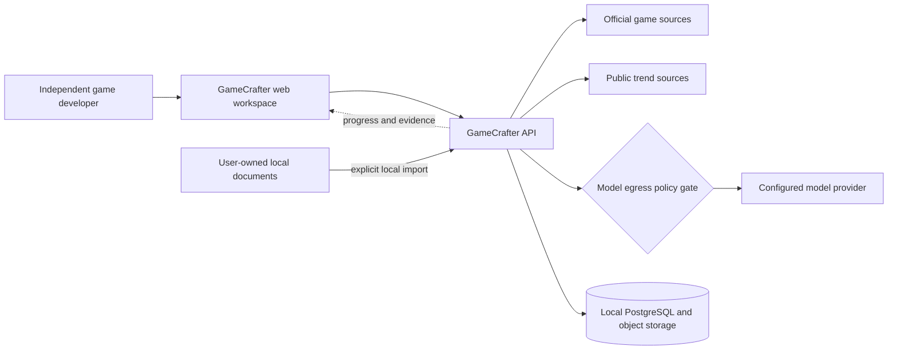

External pages, trend responses, model responses, and imported documents cross a trust boundary. They are treated as untrusted data, validated, versioned, and prevented from directly controlling tools. Before any model call, the egress gate shows which data will leave the machine, applies provider policy, and redacts secrets or unnecessary private content.

## Implemented M1-A to M1-C C3a runtime

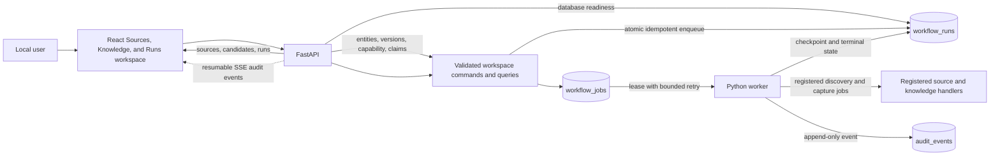

The worker-to-handler arrow is implemented in M1-B B3; the commands, queries, and event delivery are
implemented in B4. C2.3a renames the substrate without replacing rows and adds `workflow_kind` to
make each run's business purpose explicit. PostgreSQL owns project, candidate, run, job, and audit
consistency. The worker never claims a website or model capability until its typed handler is
implemented and registered. C2.4a adds Knowledge delivery queries and correction commands; C2.4b
connects them to a bilingual, responsive interface without weakening the human-review boundary.

## Implemented M1-B B1 evidence contracts

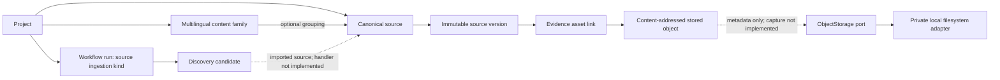

B1 creates these domain, database, and storage contracts. It does not discover or capture a live
website. PostgreSQL prevents updates to stored-object metadata, source versions, and evidence links;
a meaningful change must create a new version. Physical object deletion remains a later,
dependency-aware application command.

## Implemented M1-B B2 controlled source boundary

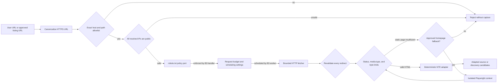

All access-flow arrows are wired by B3. HTTP is the default. Browser rendering is allowed only for
explicitly listed NTE homepage paths, runs in a fresh context, blocks downloads, popups, service
workers, and cross-host requests, and still applies the same final-URL and response-size boundary.

The first adapters accept only `nte.perfectworld.com` global pages under `en`, `cn`, or `jp`, plus
`yh.wanmei.com` mainland pages. Listing pages can produce reviewable candidates but cannot be
directly imported as evidence. Homepage and article URLs are assigned deterministic locale, region,
source type, raw category, and classification-basis metadata. A date segment in an article URL is
kept only as a family-grouping signal; it is not asserted as the publication date.

## Implemented M1-B B3 ingestion and persistence flow

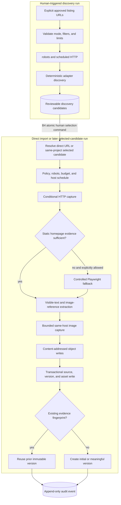

Discovery and capture are deliberately separate durable runs. A candidate may be captured only
after it is selected and belongs to the capture run's project; this preserves the human gate
without trying to reopen an already completed discovery run. Direct URL import is itself an
explicit human action. No scheduled or recursive crawl exists.

## Implemented M1-B B4 delivery and observability

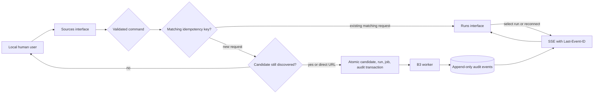

Candidate selection and run enqueue commit together. Conflicting idempotency-key reuse and stale
candidate selection are rejected rather than silently creating ambiguous work. SSE reads only
project/run audit records, uses a durable cursor, and never sends raw evidence bytes or credentials.
The interface defaults to Simplified Chinese because the product users are often Chinese studios;
English is an explicit remembered preference even though the first marketing target is English
TikTok.

The version fingerprint covers the parser version, normalized text, and captured image digests.
Byte-identical or semantically unchanged recaptures reuse the existing version. Changed text or an
evidence image creates a new immutable version linked to its predecessor. Raw HTML remains stored
for replay even though incidental markup-only changes do not automatically create versions.

## Knowledge-ingestion state graph

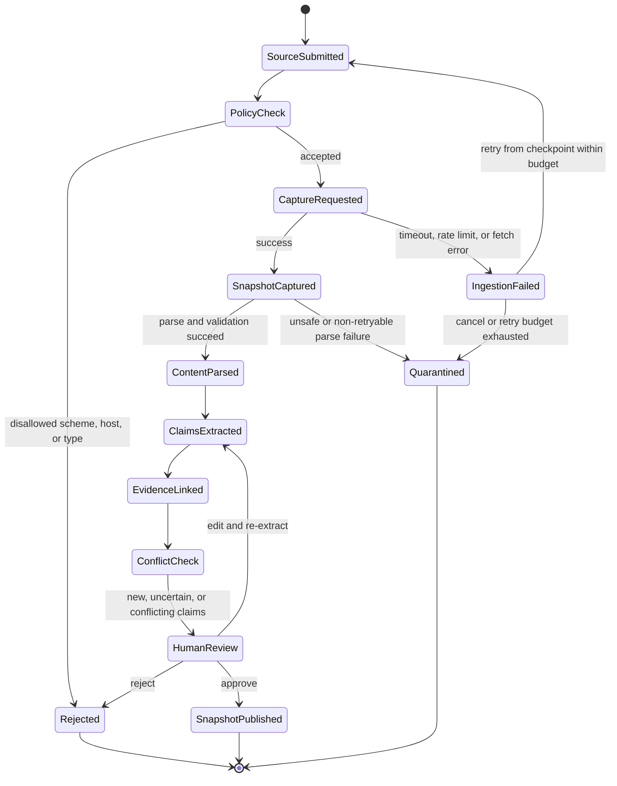

Key rules:

- raw snapshots are immutable;
- processed documents record parser and schema versions;
- claims preserve source, time, region, version, and evidence spans;
- uncertain or conflicting claims do not become approved facts automatically;
- marketing runs reference a frozen knowledge snapshot, not mutable live records.
- retry counts, terminal failures, and quarantine reasons remain visible in the run record.

## Implemented M1-C C1 reviewable knowledge lineage

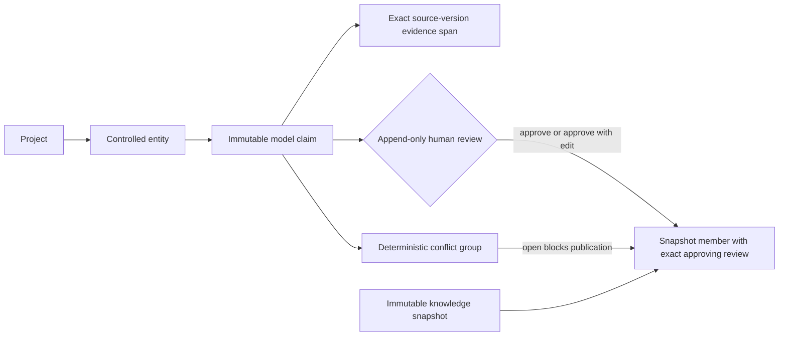

The claim is never updated into a fact. Its model value, evidence, model name, prompt version,
schema version, locale, region, effective time, and game version remain immutable. A human decision
is a separate append-only record; an approved edit stores the exact accepted value without erasing
the model output. Snapshot membership references that specific approving review.

PostgreSQL triggers reject approval without evidence, reject cross-project review or snapshot
lineage, reject snapshot membership while a claim belongs to an open conflict group, and prevent
changes to published knowledge lineage. Application commands in C3 and C4 will explain these gates
before transaction execution and will prevent empty snapshots.

## Implemented M1-C C2.1 zero-cost model boundary

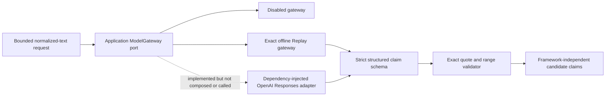

The application port owns provider-neutral requests, fingerprints, validated results, token usage,
and safe failure types. Infrastructure adapters depend inward on that port. The disabled adapter
fails closed. Replay accepts a fixture only when its key matches the exact source version, text,
offset, subject, locale, region, prompt version, and schema version.

The OpenAI adapter constructs a Responses request with strict JSON Schema, `store: false`, bounded
output, low reasoning effort, and no source identifier, URL, path, secret, raw HTML, image, or log
content. C2.1 injects a simulated client in tests; it does not install the OpenAI SDK, read an API
key, create a live client, or make a network call. Runnable cloud composition and egress preflight
remain later work, and the confirmed strict zero-cost policy prohibits cloud execution.

Both replay and provider output pass the same decoder. A candidate is rejected unless every quote
exactly equals its cited chunk range, its declared value kind matches its JSON value, and its
predicate belongs to the controlled vocabulary. Chunk-relative ranges become source-version
absolute ranges before leaving the adapter.

## Implemented M1-C C2.2 deterministic extraction Harness

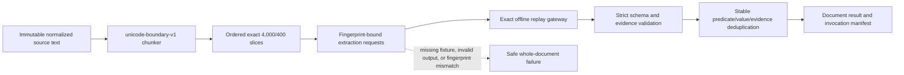

The chunker never trims or normalizes its input. It prefers paragraph, newline, and sentence
boundaries, then hard-splits only when necessary. Chunk ranges use Python Unicode code-point
indices and each chunk ID binds the chunker version, configuration, order, offsets, and exact text.

The Harness is a single sequential Knowledge Curator orchestration service, not a ReAct loop or
multi-Agent conversation. Stable ordering makes replay and debugging reproducible. Any chunk
failure suppresses partial output, and the public error omits source text and provider messages.
Successful results retain chunk IDs, request fingerprints, provider/model/response identifiers,
usage, and claim counts. Overlap duplicates are removed only when predicate, value kind, value,
and absolute evidence are identical; the first deterministic result is retained.

The committed NTE fixture freezes a minimal English official-homepage description with URL,
capture time, public-material notice, source-text digest, and exact request fingerprint. Its test
blocks socket connections, proving the replay path does not require a model SDK, API key, provider
network request, or token spend. It is a test snapshot of public material, not an internal GDD or
live-site acceptance evidence.

## Implemented M1-C C2.3a generic workflow substrate

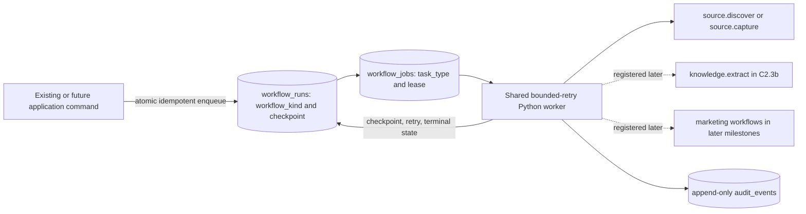

C2.3a is an infrastructure generalization, not durable extraction. The migration renames the
existing tables in place, preserves identifiers and all foreign-key lineage, backfills each legacy
run's `workflow_kind` from its earliest job, and retains `system.unknown` only for legacy runs that
have no job. Upgrade/downgrade tests cover run, job, audit, and extraction-claim references. The
existing `/runs` route and source UI retain `task_type` compatibility while exposing the new generic
kind. One queue prevents source ingestion, knowledge extraction, and later marketing execution from
developing incompatible retry, checkpoint, and observability semantics.

## Implemented M1-C C2.3b durable extraction closure

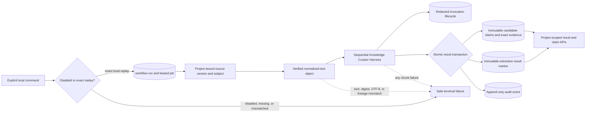

The API validates the project, immutable source version, subject, fixture provenance, source digest,
and deterministic request coverage before enqueue. The worker repeats all authoritative checks and
reads bytes only through `ObjectStorage`. Per-attempt invocation rows contain hashes, offsets,
provider/model/response identifiers, usage, counts, timestamps, and safe error codes; they never
contain prompt, source, response, secret, or object-path bodies.

Claims, evidence spans, the result marker, and the success audit event commit together. A result
marker makes later delivery of the same run a no-op, while attempts that stop before that commit
remain observable. PostgreSQL triggers keep run, source, subject, and project lineage aligned and
make the result marker immutable. C2.3b remains one deterministic specialist node: it does not add
ReAct, self-learning, agent-to-agent conversation, or an MCP service.

## Implemented M1-C C2.4a-C2.4b Knowledge delivery workspace

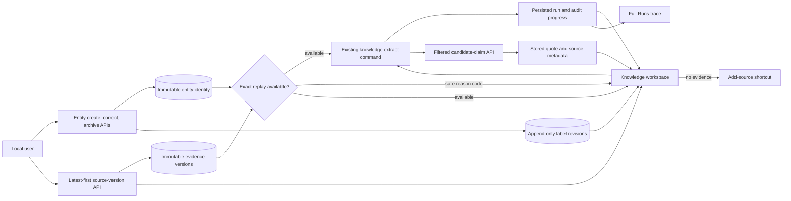

Entity IDs, project ownership, type, and canonical keys remain stable. A correction appends a new
display-name/alias revision; it never updates or relocates existing claims. Archival appends one
terminal revision and archived subjects cannot start extraction. The migration backfills one
baseline revision for every existing entity, and PostgreSQL makes all revision rows immutable.

The capability endpoint is read-only and reports disabled, missing, invalid, target-mismatched,
fixture-incomplete, or available states without exposing local paths or constructing a live model
client. Source-version reads default naturally to the latest item while retaining every historical
version. Candidate claims can be filtered by subject or extraction run and include the exact stored
quote plus source URL, title, locale, region, fetch time, and version number rendered by the C2.4b
evidence panel.

The Knowledge workspace defaults to the latest usable source version while keeping historical
versions selectable. It creates or corrects game identities, shows safe capability reason codes,
starts the existing durable extraction command, derives its four-stage display from persisted run
and audit records, and links to the complete Runs trace. Claims remain explicitly labelled as AI
candidates that have not been reviewed. Missing evidence leads back to Sources. No review or
publication command is introduced here, so the interface cannot visually promote a candidate into
an approved fact.

## Implemented M1-C C2.5 NTE PostgreSQL acceptance

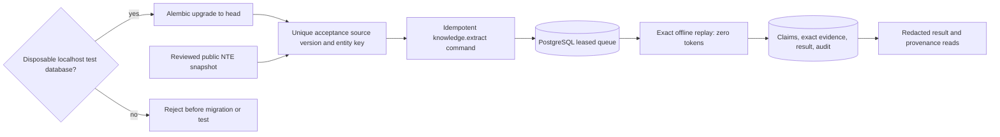

The acceptance uses a unique project, source version, entity, command key, and filesystem object
root. The reviewed fixture output is rebound to the exact unique request fingerprint in test code;
no approximate match or live model fallback is allowed. PostgreSQL must persist one job, one
zero-token invocation, two candidate Claims, two evidence spans, the immutable result marker, and
the completion audit events. Every returned quote must exist in the normalized snapshot and carry
the same source-version lineage.

The local runner accepts only localhost URLs whose database name contains `test` or `acceptance`.
Rows are not silently deleted because audit history is part of the contract. This proves the
production PostgreSQL path for the reviewed NTE snapshot, but it is not current live-site capture
evidence and is labelled accordingly.

## Implemented M1-C C3a deterministic conflict reconciliation

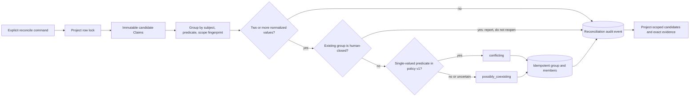

The classifier is deterministic and versioned as `claim-conflict-v1`. It never reads model
confidence, calls a model, chooses a winner, or creates an approved fact. Only game name, release
status/date, and primary genre are considered single-valued inside an already exact scope. All
other predicates are conservatively marked as possibly coexisting for human review.

The project lock serializes concurrent reconciliation. Existing unique keys and missing-member
checks make retries idempotent. A resolved or dismissed group is never silently reopened when new
Claims appear; the command reports the skipped closed scope in its response and audit payload.

## Marketing workflow state graph

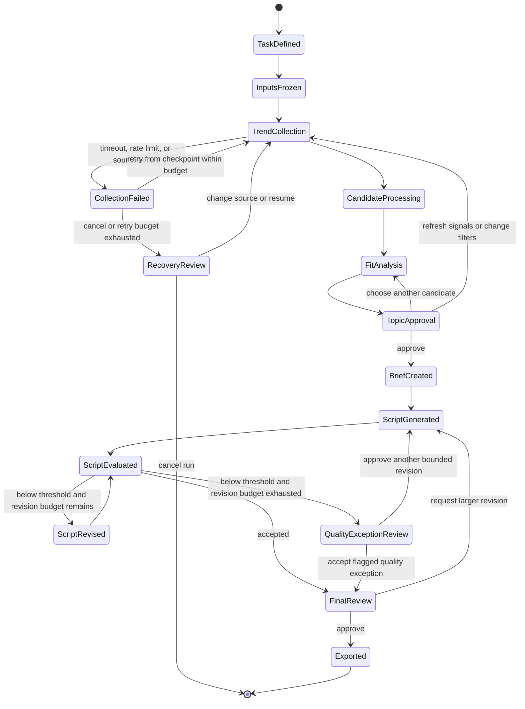

The run freezes the task definition, knowledge snapshot, source policy, model, prompt, skill, and rule versions before generation. The revision loop has a fixed budget. A model score never replaces topic or final-output approval, and an exhausted budget cannot silently convert a low-quality script into an accepted one. The Agent Harness routes retryable model or tool failures back to the last safe checkpoint and exposes terminal failures for human recovery.

## Component relationships

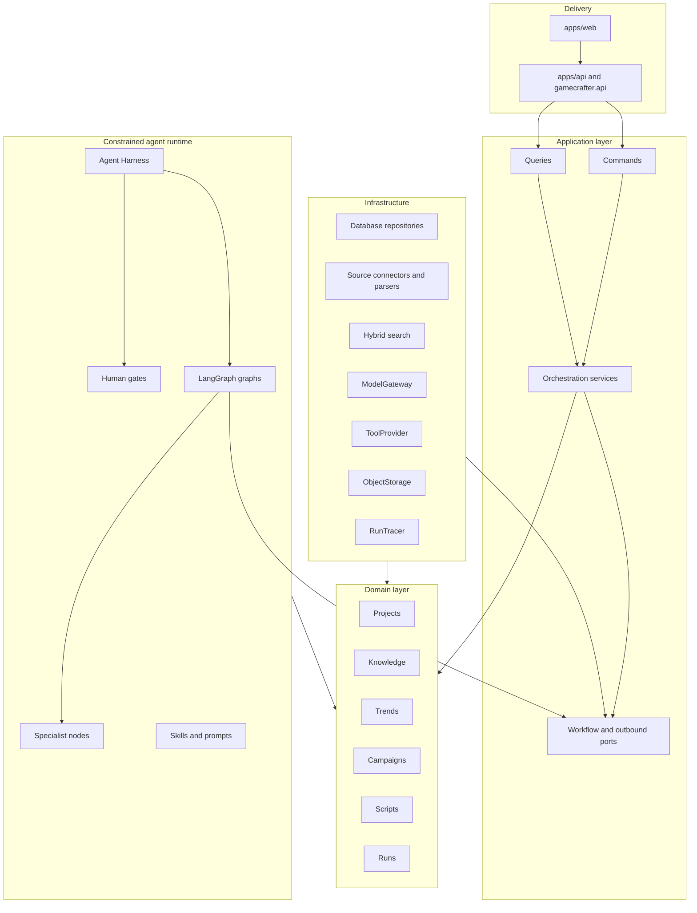

The arrows in this diagram show source-code dependency direction, not runtime data flow. Delivery depends on application contracts; runtime and infrastructure adapters implement application ports and depend inward on application/domain contracts. Domain modules never depend on infrastructure. This direction is enforced by convention and architecture tests: domain modules must not import FastAPI, LangGraph, model SDKs, database drivers, or source-specific clients.

## Agent Harness

The Agent Harness is the controlled execution shell around graphs and specialist nodes. It is not another model or simulated employee. It provides:

- typed state validation before and after every node;
- checkpoints, idempotency keys, resumable human pauses, and replay metadata;
- model, token, latency, cost, tool-call, retry, and wall-clock budgets;
- tool allowlists, argument validation, timeouts, cancellation, and permission checks;
- model-egress review, secret redaction, and untrusted-content isolation;
- structured failure states and last-safe-checkpoint recovery;
- trace propagation across models, tools, human decisions, and exports.

The initial ToolProvider implementations stay in-process. MCP is an optional adapter behind that boundary only when cross-application reuse or independently managed permissions justify it; MCP is not the core orchestration mechanism.

## Planned specialist nodes

- Knowledge Curator: structures evidence-backed game claims.
- Trend Analyst: clusters trends and explains task fit.
- Script Writer: produces structured script versions from approved inputs.
- Quality Critic: evaluates explicit dimensions and proposes bounded revisions.

These are workflow roles, not simulated employees. Parallelism is used for independent source fetches, candidate analyses, and evaluation dimensions; human decisions remain sequential gates.

## Reasoning and learning policy

Specialist research nodes may use a bounded `Perceive → Reason → Act → Evaluate` cycle. ReAct is limited to nodes that genuinely need tools and always runs inside Harness budgets and allowlists. ReWOO is not the global workflow pattern because the state graph already provides an explicit, inspectable plan.

`Learn` is intentionally outside the live run. Production agents cannot rewrite their own prompts, skills, policies, or tools. Human-approved feedback becomes a versioned offline evaluation case; a tested prompt, skill, rule, or model update is then released as a new version. This prevents silent behavior drift and preserves rollback and attribution.

## Storage direction

M1-A implements PostgreSQL, enables pgvector, and initially stores projects, ingestion runs, leased
jobs, and audit events. C2.3a data-preservingly renames those execution tables to `workflow_runs`
and `workflow_jobs`, adds the nonblank `workflow_kind`, and retains the PostgreSQL lease queue.
M1-B B1 adds source identities, immutable evidence versions, multilingual content
families, discovery candidates, stored-object metadata, and evidence links. Large bytes use the
`ObjectStorage` application port; its first adapter is a private content-addressed local filesystem.
B2 adds source-policy, `PageFetcher`, and `SiteAdapter` boundaries. B3 writes raw HTML, normalized
text, bounded official images, source identities, version lineage, evidence links, and audit events
through registered worker handlers. B4 reads project-scoped summaries and creates candidate/run/job
state in one PostgreSQL transaction; SSE projects append-only audit events to the browser.
PostgreSQL and object storage cannot commit atomically;
content-addressed files written immediately before a failed DB transaction may be left unreferenced
and require a later safe garbage-collection command. Embeddings and claim records remain
unimplemented at the M1-B boundary.

M1-C C1 adds project-local entities, immutable candidate claims, exact evidence ranges, append-only
human reviews, conflict groups, and immutable knowledge snapshots. It does not yet add extraction,
model calls, conflict classification, review APIs, or embeddings.

M1-C C2.1 adds the framework-independent model port and zero-cost adapters. C2.2 adds the pure
deterministic source chunker, sequential extraction Harness, invocation manifest, strict fixture
loader, and source-attributed NTE offline replay. C2.3a supplies the generic durable execution
substrate. C2.3b registers its extraction handler, validates stored text, persists redacted
invocations plus atomic claim/evidence/result lineage, and exposes preflighted command/read APIs.
The product interface, live model call, conflict classifier, and review action remain unimplemented.

## Observability

Each workflow run progressively records:

- run and trace identifiers;
- node state and checkpoint;
- source, model, prompt, skill, and rule versions;
- tool calls, latency, retries, token usage, and estimated cost;
- redacted input/output hashes, egress decisions, and failure classifications;
- human approvals, edits, rejections, and reasons;
- script version lineage and export state;
- evaluation dataset, rubric, threshold, and release versions.
