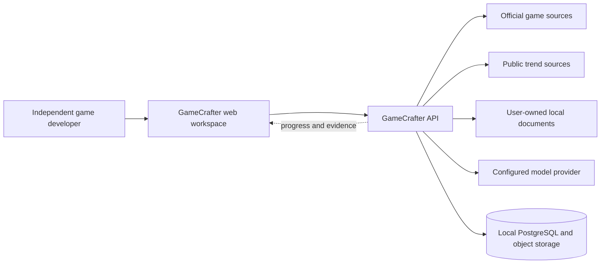
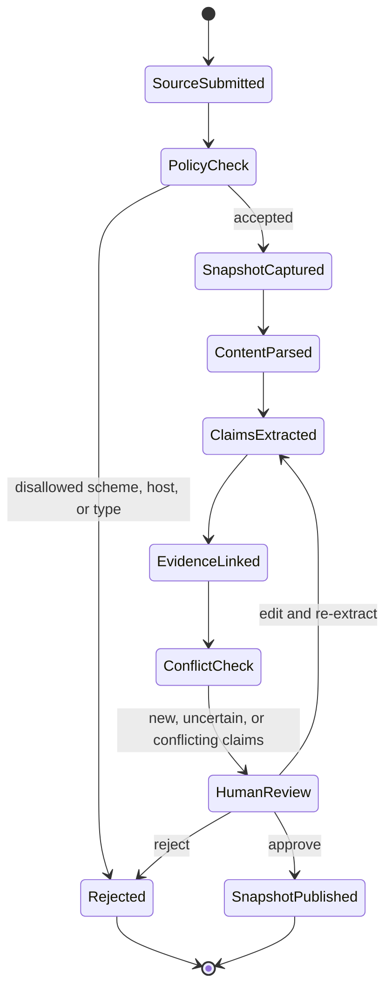
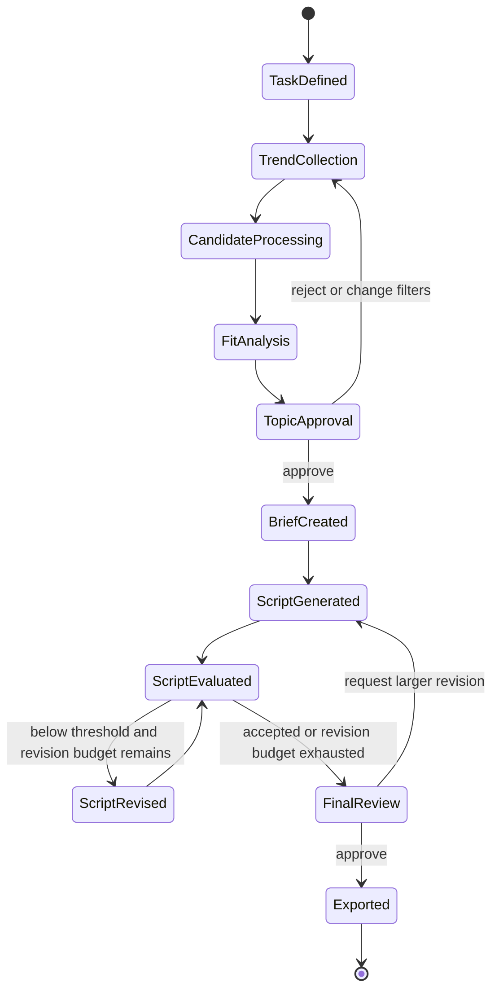
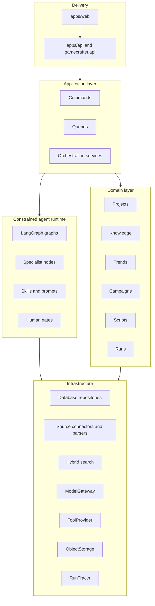

# System architecture and workflow DAGs

GameCrafter v2 uses a modular monolith with explicit domain and adapter boundaries. The design prioritizes traceability, local development, testability, and a path to future multi-tenant operation without prematurely creating distributed services.

## System context

External pages, trend responses, model responses, and uploaded documents cross a trust boundary. They are treated as untrusted data, validated, versioned, and prevented from directly controlling tools.

## Knowledge-ingestion state graph

Key rules:

- raw snapshots are immutable;
- processed documents record parser and schema versions;
- claims preserve source, time, region, version, and evidence spans;
- uncertain or conflicting claims do not become approved facts automatically;
- marketing runs reference a frozen knowledge snapshot, not mutable live records.

## Marketing workflow state graph

The revision loop has a fixed budget. A model score never replaces topic or final-output approval.

## Component relationships

Dependency direction is enforced by convention and tests: domain modules must not import FastAPI, model SDKs, or source-specific clients.

## Planned specialist nodes

- Knowledge Curator: structures evidence-backed game claims.
- Trend Analyst: clusters trends and explains task fit.
- Script Writer: produces structured script versions from approved inputs.
- Quality Critic: evaluates explicit dimensions and proposes bounded revisions.

These are workflow roles, not simulated employees. Parallelism is used for independent source fetches, candidate analyses, and evaluation dimensions; human decisions remain sequential gates.

## Storage direction

The target persistence layer is PostgreSQL with full-text search and pgvector. Raw pages, documents, and large responses use an object-storage interface. M0 does not yet implement persistence; this diagram records the intended boundary for later milestones.

## Observability

Each future run will record:

- run and trace identifiers;
- node state and checkpoint;
- source, model, prompt, skill, and rule versions;
- tool calls, latency, retries, token usage, and estimated cost;
- human approvals, edits, rejections, and reasons;
- script version lineage and export state.
